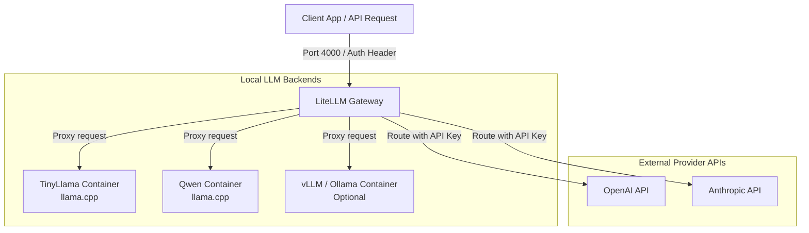

# LiteLLM LLM Server & Gateway

A production-ready, highly-configurable LLM proxy and gateway system. This setup uses [LiteLLM](https://github.com/BerriAI/litellm) to provide a single, unified, OpenAI-compatible API interface that routes requests to various LLM backends (such as local self-hosted models or external commercial APIs like OpenAI, Anthropic, and Gemini).

---

## Table of Contents
1. [Overview & Architecture](#overview--architecture)
2. [Project Structure](#project-structure)
3. [Prerequisites](#prerequisites)
4. [Deployment Guide](#deployment-guide)
5. [Adding and Customizing Models](#adding-and-customizing-models)
    - [Self-Hosted (vLLM, Ollama, llama.cpp)](#1-self-hosted-engines-via-docker)
    - [Commercial APIs (OpenAI, Anthropic, Gemini)](#2-commercial-api-providers)
6. [Securing the Gateway (Nginx Integration)](#securing-the-gateway-nginx-integration)
7. [API Verification Examples](#api-verification-examples)

---

## Overview & Architecture



### Key Benefits
* **OpenAI-Compatible Interface:** Speak to any local or remote model using the standard OpenAI client libraries (`openai` package in Python, Node, etc.).
* **Load Balancing & Failover:** Automatically retry and route requests across multiple redundant model endpoints.
* **Unified Key Management:** Define a `master_key` or individual user keys at the LiteLLM gateway layer to manage access easily.

---

## Project Structure

```bash
.
├── docker-compose.yaml     # Service orchestrator (llama.cpp, LiteLLM, etc.)
├── litellm/
│   └── config.yaml         # LiteLLM routing rules and model list
├── nginx/                  # Optional frontend proxy files for rate-limiting & auth
│   ├── nginx.conf
│   └── api_keys.map
└── models/                 # Shared volume folder storing downloaded GGUF weights
```

---

## Prerequisites

Before deploying, ensure you have the following installed on your system:
* [Docker](https://docs.docker.com/get-docker/)
* [Docker Compose V2](https://docs.docker.com/compose/)
* [Git](https://git-scm.com/)

---

## Deployment Guide

### Step 1: Clone the Repository
```bash
git clone <your-repo-url>
cd LLM
```

### Step 2: Configure Models in LiteLLM
Open [litellm/config.yaml](file:///home/bwrpsp/proj/LLM/litellm/config.yaml) to inspect the model endpoints. By default, it is configured with:
* `tinyllama` (forwarded to the `tinyllama` container)
* `qwen-small` (forwarded to the `qwen-small` container)
* Master API Key: `sk-super-secret-key` (You should change this in production!)

### Step 3: Run the Stack
Start the containers in detached mode:
```bash
docker compose up -d
```

Docker will automatically pull the LiteLLM and `llama.cpp` server images, download the required model weights (TinyLlama and Qwen) into the `./models` directory, and start the services.

### Step 4: Verify the Services
Check the container logs to ensure everything is initialized:
```bash
docker compose logs -f
```

---

## Adding and Customizing Models

LiteLLM makes it incredibly easy to switch, add, or customize models. You are **not** locked into `llama.cpp`. You can add alternative inference engines or third-party APIs.

### 1. Self-Hosted Engines via Docker

If you want to use **vLLM**, **Ollama**, or another backend:

#### Step A: Add the Service to `docker-compose.yaml`
Add a new service block in [docker-compose.yaml](file:///home/bwrpsp/proj/LLM/docker-compose.yaml) matching the runtime of your choice.

**Example: Adding a vLLM container**
```yaml
  vllm-server:
    image: vllm/vllm-openai:latest
    container_name: vllm-server
    restart: unless-stopped
    environment:
      - HUGGING_FACE_HUB_TOKEN=your_token_here
    volumes:
      - ~/.cache/huggingface:/root/.cache/huggingface
    ports:
      - "8000:8000"
    ipc: host
    deploy:
      resources:
        reservations:
          devices:
            - driver: nvidia
              count: all
              capabilities: [gpu]
    command: --model facebook/opt-125m
```

#### Step B: Map the Model in LiteLLM
Add the corresponding mapping inside [litellm/config.yaml](file:///home/bwrpsp/proj/LLM/litellm/config.yaml):
```yaml
model_list:
  # ... existing models ...

  - model_name: my-vllm-model
    litellm_params:
      model: openai/facebook/opt-125m
      api_base: http://vllm-server:8000/v1
      api_key: dummy
```

---

### 2. Commercial API Providers

You can also use external models (OpenAI, Anthropic, Gemini, etc.) directly. You only need to configure them in LiteLLM without spinning up any local containers.

Add the following to [litellm/config.yaml](file:///home/bwrpsp/proj/LLM/litellm/config.yaml):
```yaml
model_list:
  - model_name: gpt-4o
    litellm_params:
      model: gpt-4o
      api_key: "os.environ/OPENAI_API_KEY"

  - model_name: claude-3-5-sonnet
    litellm_params:
      model: anthropic/claude-3-5-sonnet-20240620
      api_key: "os.environ/ANTHROPIC_API_KEY"
```

Pass the required environment keys to the `litellm` service in your [docker-compose.yaml](file:///home/bwrpsp/proj/LLM/docker-compose.yaml):
```yaml
  litellm:
    ...
    environment:
      - OPENAI_API_KEY=your-openai-api-key
      - ANTHROPIC_API_KEY=your-anthropic-api-key
```

---

## Securing the Gateway (Nginx Integration)

The repository includes a template for Nginx reverse-proxy setup under [nginx/nginx.conf](file:///home/bwrpsp/proj/LLM/nginx/nginx.conf) and [nginx/api_keys.map](file:///home/bwrpsp/proj/LLM/nginx/api_keys.map). 

To leverage this for rate-limiting and authenticating clients:
1. Update `upstream llm_backend` in [nginx.conf](file:///home/bwrpsp/proj/LLM/nginx/nginx.conf) to point to the LiteLLM container instead of llama-cpp:
   ```nginx
   upstream llm_backend {
       server litellm:4000;
   }
   ```
2. Define accepted client tokens in [api_keys.map](file:///home/bwrpsp/proj/LLM/nginx/api_keys.map).
3. Mount/run Nginx container in [docker-compose.yaml](file:///home/bwrpsp/proj/LLM/docker-compose.yaml) listening on port 80/443.

---

## API Verification Examples

Once the stack is up, you can test LiteLLM using standard HTTP/curl requests.

### 1. List Available Models
```bash
curl --location 'http://localhost:4000/v1/models' \
--header 'Authorization: Bearer sk-super-secret-key'
```

### 2. Chat Completion Request (TinyLlama)
```bash
curl --location 'http://localhost:4000/v1/chat/completions' \
--header 'Content-Type: application/json' \
--header 'Authorization: Bearer sk-super-secret-key' \
--data '{
  "model": "tinyllama",
  "messages": [
    {
      "role": "user",
      "content": "Why is the sky blue? Answer in one sentence."
    }
  ],
  "temperature": 0.2
}'
```

### 3. Chat Completion Request (Qwen)
```bash
curl --location 'http://localhost:4000/v1/chat/completions' \
--header 'Content-Type: application/json' \
--header 'Authorization: Bearer sk-super-secret-key' \
--data '{
  "model": "qwen-small",
  "messages": [
    {
      "role": "user",
      "content": "What is the capital of France?"
    }
  ],
  "temperature": 0.0
}'
```
