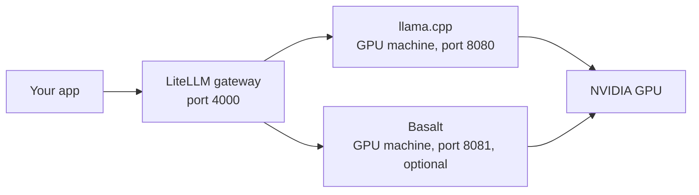

# litellm-inference-setup

Run models on your NVIDIA GPU with llama.cpp, and optionally Basalt, then call them all through one OpenAI-compatible API.

- **llama.cpp** runs GGUF model files (a compressed model format).
- **Basalt** runs `.basalt` model files on RTX 50 series GPUs.
- **LiteLLM gateway** is one API in front of your servers. Your app talks only to the gateway.


```mermaid
flowchart LR
    App[Your app] --> LiteLLM[LiteLLM gateway<br/>port 4000]
    LiteLLM --> LlamaCpp[llama.cpp<br/>GPU machine, port 8080]
    LiteLLM --> Basalt[Basalt<br/>GPU machine, port 8081, optional]
    LlamaCpp --> GPU[NVIDIA GPU]
    Basalt --> GPU
```

| Service | Address | Role |
|---|---|---|
| [llama.cpp](https://github.com/ggml-org/llama.cpp) | `http://<host>:8080` | Runs the models on the GPU |
| [Basalt](https://github.com/jesdga95/basalt) | `http://<host>:8081` | Runs `.basalt` models on RTX 50 series GPUs, optional |
| [LiteLLM](https://docs.litellm.ai) | `http://<host>:4000` | Gateway and API. Admin UI at `/ui` |

The ports come from `setup.conf`. The values above are the defaults. See [Setup and roles](docs/setup.md).

## Requirements

- [Docker](https://docs.docker.com/get-docker/) with [Docker Compose](https://docs.docker.com/compose/)
- NVIDIA GPU with the [NVIDIA Container Toolkit](https://docs.nvidia.com/datacenter/cloud-native/container-toolkit/latest/install-guide.html)
- For Basalt only:
  - RTX 50 series (Blackwell) GPU
  - NVIDIA driver 580 or newer

## Quick start

The model servers run on the GPU machine. LiteLLM runs on the gateway machine. One machine can do both. See [Setup and roles](docs/setup.md).

**1. On the GPU machine**

1. Clone the repo and run the setup script.

   ```bash
   git clone https://github.com/AzPepoze/litellm-inference-setup.git
   cd litellm-inference-setup
   ./setup.sh
   ```

2. Choose `1` (model servers).
3. Add a model. See [Models](docs/models.md) for llama.cpp and [Basalt](docs/basalt.md) for Basalt.

**2. On the gateway machine**

1. Clone the repo and run the setup script.

   ```bash
   git clone https://github.com/AzPepoze/litellm-inference-setup.git
   cd litellm-inference-setup
   ./setup.sh
   ```

2. Choose `2` (gateway).
3. Enter the model server address and keys. On the GPU machine, run `./setup.sh connect` to see them.

> [!IMPORTANT]
> Use the machine's name or IP for the model server address. Do not use `localhost`: LiteLLM runs in Docker.

**3. Open the admin UI**

Open `http://<gateway-machine>:4000/ui/` and check that your models are listed.

## Call the API

```bash
curl http://localhost:4000/v1/chat/completions \
  -H "Authorization: Bearer <LITELLM_ADMIN_PASSWORD>" \
  -H "Content-Type: application/json" \
  -d '{"model":"<model-name>","messages":[{"role":"user","content":"hi"}]}'
```

- Replace `<LITELLM_ADMIN_PASSWORD>` with the value in `litellm/.env`. This password is also the API key for your clients.
- Replace `<model-name>` with the name shown in the Admin UI.

## Update llama.cpp

```bash
cd inference/llama-cpp
./update.sh                      # pulls the newest llama.cpp image
docker compose up -d             # restarts with the new image
```

## Update Basalt

```bash
cd inference/basalt
./update.sh                      # rebuilds the Basalt image from the pinned release
docker compose up -d             # restarts with the new image
```

## Private files

These files hold your secrets and settings. Git ignores them.

| Path | Holds |
|---|---|
| `setup.conf` | Roles, enabled servers and ports |
| `litellm/.env` | Database and admin passwords |
| `inference/llama-cpp/.env` | llama.cpp API key |
| `inference/llama-cpp/presets.ini` | Your model list and settings |
| `litellm/provider/providers.ini` | Your server addresses and keys |
| `inference/llama-cpp/models/` | Downloaded model weights |
| `litellm/config.yaml` | Generated at every gateway start |
| `inference/basalt/basalt_config.json` | Basalt settings |
| `inference/basalt/api_key` | Basalt API key |
| `inference/basalt/models/` | Basalt model files |

## More

| Topic | Page |
|---|---|
| Setup and roles | [docs/setup.md](docs/setup.md) |
| Manual setup | [docs/manual-setup.md](docs/manual-setup.md) |
| Models and presets | [docs/models.md](docs/models.md) |
| Providers and sync | [docs/providers.md](docs/providers.md) |
| Basalt | [docs/basalt.md](docs/basalt.md) |
